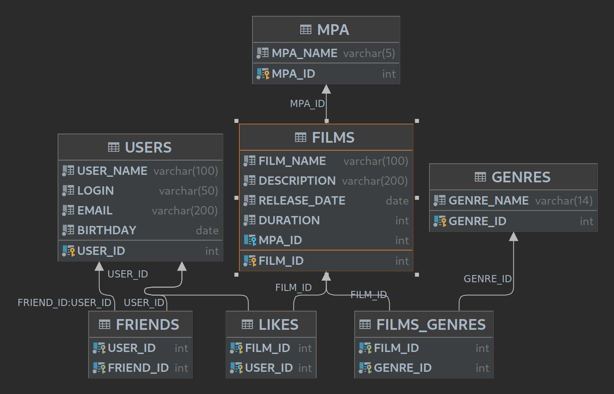

# Filmorate
Template repository for Filmorate project.
## Class diagram

## SQL Queries
Find all users
`SELECT USER_ID, USER_NAME, LOGIN, EMAIL, BIRTHDAY FROM USERS WHERE USER_ID = ?`

Find friends by user
`SELECT U.* FROM USERS U JOIN FRIENDS F on U.USER_ID = F.FRIEND_ID WHERE F.USER_ID = ?`

Find common friends by user1 and user2
`SELECT U.* FROM USERS U JOIN FRIENDS F on U.USER_ID = F.FRIEND_ID JOIN FRIENDS F2 on U.USER_ID = F2.FRIEND_ID WHERE F.USER_ID = ? AND F2.USER_ID = ?`
